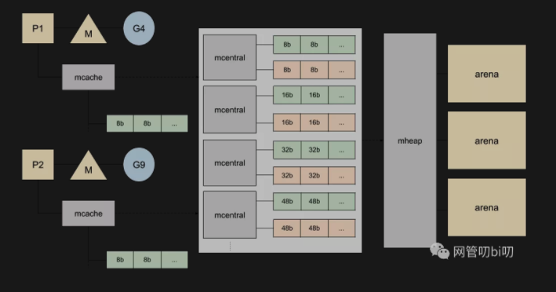

### 什么是GC

### GC回收的是什么

### GC算法种类

### GO的GC算法

### 标记清除算法缺点

### 三色标记清除法步骤

### 三色不变性

### Go混合写屏障

### 一次完整的GC过程

[点击跳转微信GC文章链接](https://mp.weixin.qq.com/s?src=11&timestamp=1629876709&ver=3273&signature=E*z6awU7xUDKR7n4s0O0sIGprR7boXXd09M78pGacU*OVG1UJXe1uyUwXtrKuCOkx6VWq6NY6q6Unsl8RLZzDHBzWvm9a-9WTS-BN5xnTKuwDPM-8YcnfvSk0f2Rr5YM&new=1)

### 内联的概念

[文章URL地址](https://mp.weixin.qq.com/s?__biz=MzUzNTY5MzU2MA==&mid=2247485736&idx=1&sn=921a9dfe3d638074b68a4fd072ea3cb9&chksm=fa80d8bfcdf751a948ea49ee620ca9d88ff0a62b4ad4e3a53321fee6813b8f90098fd72f7b11&token=940952510&lang=zh_CN&scene=21#wechat_redirect)

### 小于32kb内存块的分配策略

